+++
date = '2025-08-08T00:16:11+08:00'
draft = false
title = 'App_first'
tag = 'app'
+++


## 设备准备

1.  硬件准备
    
    i. 准备一台能ROOT的手机，Pixel系列最佳（为后续自编ROM带来便利），本系列使用的设备是(pixel 9 tokay)

    ii. ROOT, 这里看自己的选择，可以使用原生Magisk， Magisk Alpha， KernelSU， Apatch， 本人不推荐使用狐狸面具，有说不清楚的毛病

    准备好 android platform tools,环境变量的设置自己搜索 windows mac linux各不相同

    这里只详细阐述谷歌系列手机的过程，xiaomi 1+等设备自行搜索网络教学

    首先找到自己的手机开发代号

    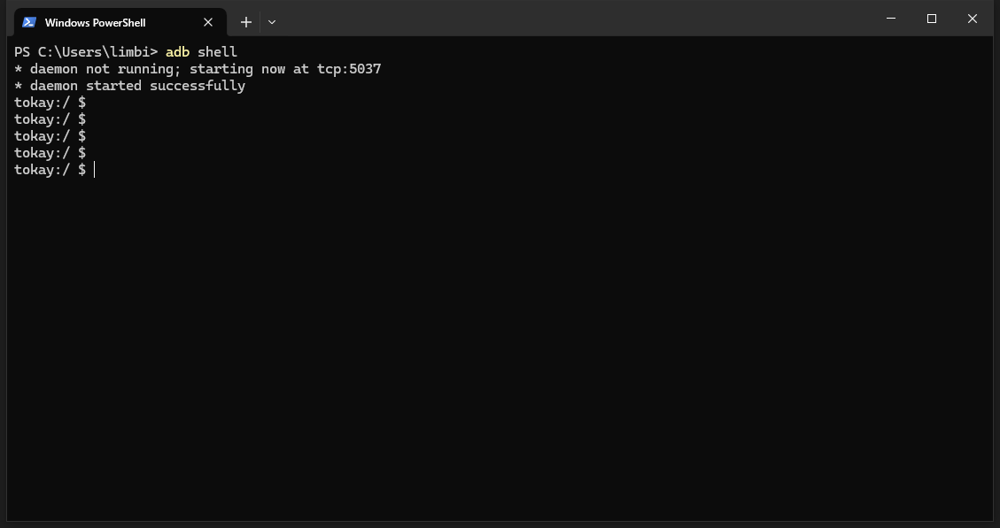

    这里有一个取巧的做法，可以直接adb shell查看，我的设备开发代号就是tokay
    
    然后去这个网站  https://developers.google.com/android/

    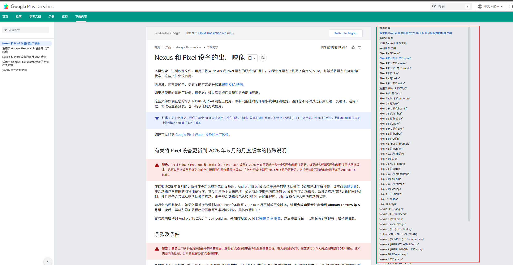

    在右边找到自己开发代号的镜像

    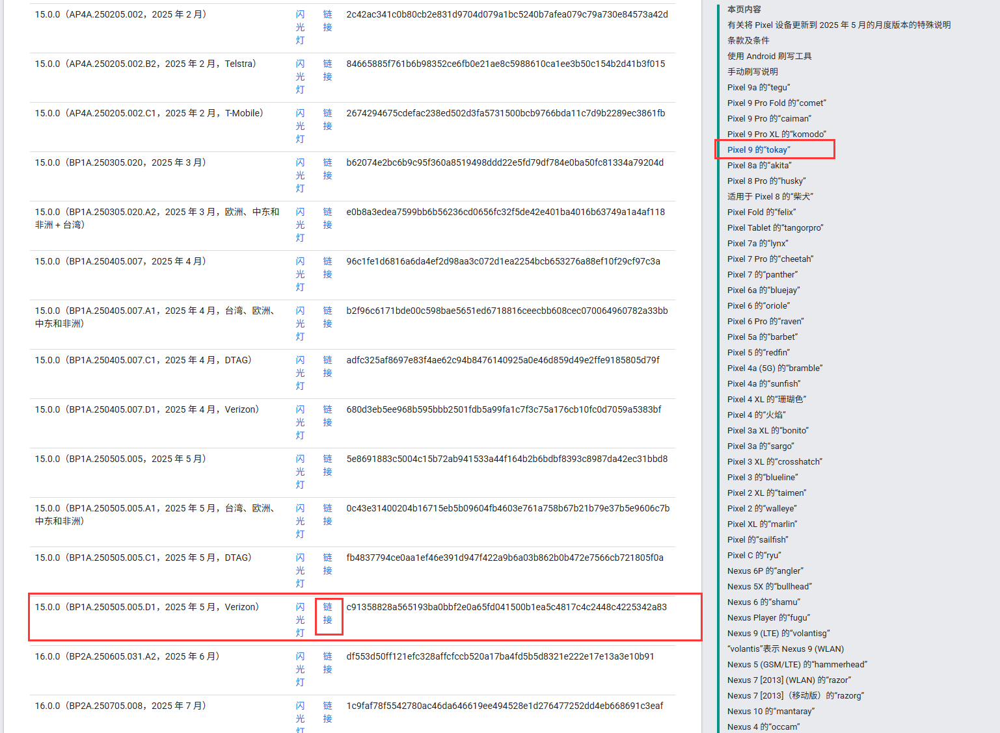

    一般选择最新的稳定版本就行了，不要选择beta
    
    下完之后就是开始刷机，之前把开发者模式打开了，在开发者设置里面打开允许oem解锁/bootloader解锁，有时候描述不一样，然后adb reboot bootloader或者关机，按住开机和音量下键，进入bootloader模式

    在bootloader界面的时候，输入这个 fastboot oem unlock，这个时候界面就会从oem locked状态变成unlocked状态

    然后解压缩压缩包打开终端，选择对应的刷写脚本，一个bat（windows）一个sh（linux/mac）很明显了，自己根据PC平台选择

    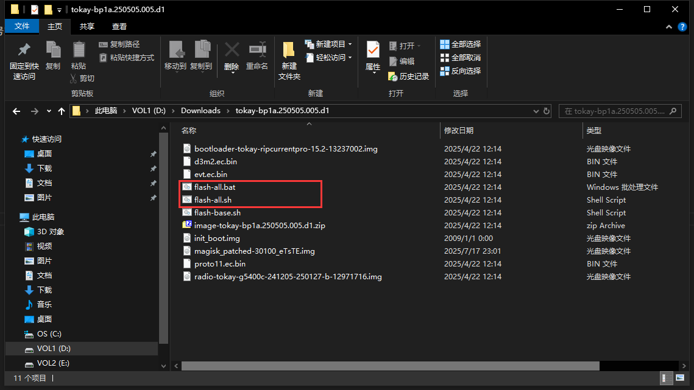

    刷写完毕之后，就是全新的系统了，这个时候先把要ROOT的镜像提取（在上图的zip包里面）出来，一般来说pixel6及以前用BOOT.IMG就行，pixel7及以后用INIT_BOOT.IMG，这个跟GKI相关，可以自行查阅google相关资料

    初始化设备之后，进到主界面，重新打开开发者模式和usb调试，，然后把对应的镜像推送到手机上 -> adb push boot.img/init_boot.img /sdcard/Download
        
    把ROOT工具的app装上，我这里选择的是Magisk Alpha，所以长这样的

    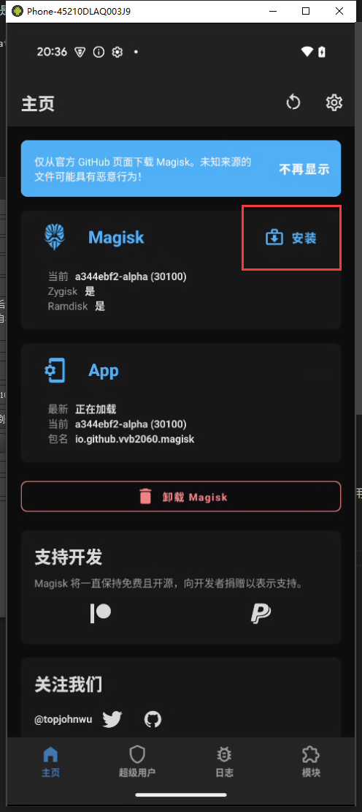


    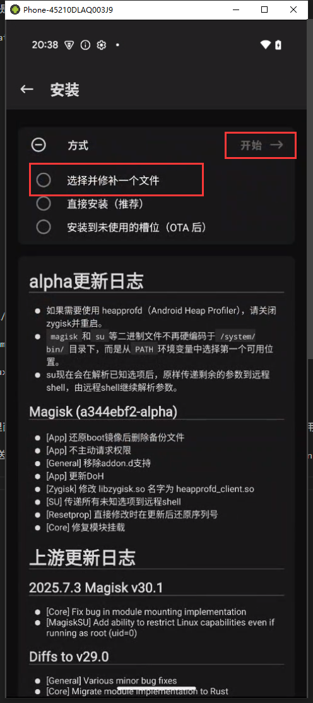


    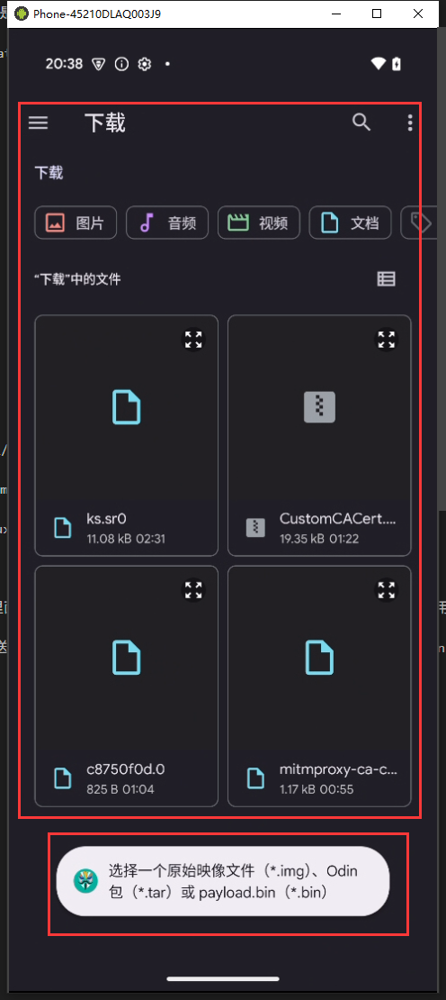


    这里选择刚才上传的img，因为我已经root过了我就不演示了

    然后会报一串东西，最后跟你说patch成功，一般会在同目录下多出一个img，用adb pull 把它拉到本地来

    然后再使用adb reboot fastboot -> fastboot flash boot/init_boot boot.img/init_boot.img （注意自己是啥）

    这样就ROOT完了


    iii. 必备的模块
    

    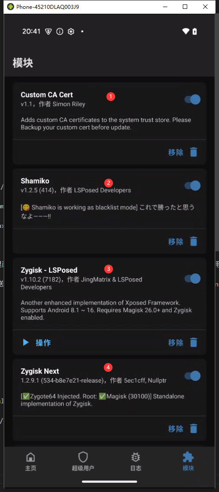


    1是安装代理证书的，因为在android11之后就不允许用户自己安装ca证书了，所以抓包很蛋疼，但是索性magisk可以通过overlay的方式把证书帮我们挂载进去，具体实现原理看magisk overlay相关的
        
    具体操作看github的说明
        
    地址：https://github.com/WindSpiritSR/CustomCACert

    2是隐藏root的，shamiko，这个要先装zygisk-next，就是隐藏root的，他会帮你unmap掉一些hook痕迹，shamiko也会隐藏zygisk-next的一些痕迹

    地址：https://github.com/LSPosed/LSPosed.github.io/releases

    3是LSposed，一个hook框架，工程化时候用到它，这个后面再说，先装上，同理他也需要zygisk的支持，官方团队的版本已经归档了，进入内部比较困难，所以这里选择用其他人的fork

    地址：https://github.com/JingMatrix/LSPosed

    4一个hook zygote的框架，只是提供了一些后门api给模块使用，到后面我们可以自己开发相关的模块，也需要利用这个，它可以让我们注入被污染的zygote及其衍生物

    地址：https://github.com/Dr-TSNG/ZygiskNext


    这些安装包都是zip，下载下来后，用adb推送到/sdcard/Download，然后再root管理器里面安装就好了，magisk是从本地安装，kernelsu应该是有个加号，然后APatch也是个加号，不过Apatch不支持shamiko，所以看自己选择


    然后一些我觉得有用的软件

    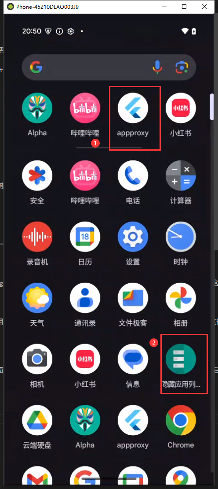

    第一个是全局代理工具，用来转发流量到我们PC的抓包软件上的，配合mitm特好使

    第二个是hma, hide my applist 这个是一个lsp的hook插件，可以让选定的应用看不到你想让他看不到的应用软件

    第三个是just trust me,用军哥的或者原作者都行，这个是绕过app 的ssl pinning的,不过有时候需要自己写插件(frida或者隐藏lsposed的)，因为毕竟hook了

    上面的做好了能达到啥效果？我演示一下抓某站的包

    打开代理


    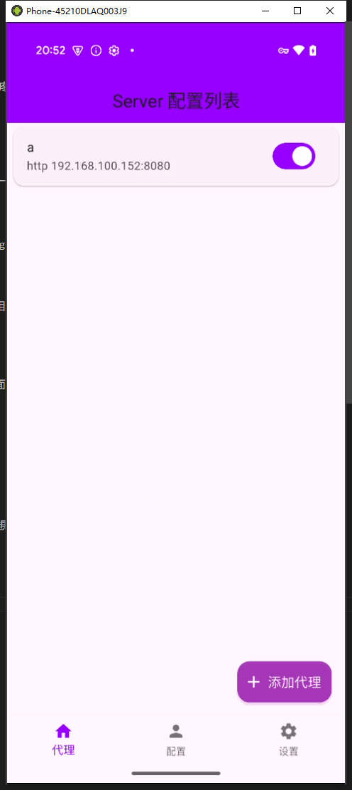

    打开mitm

    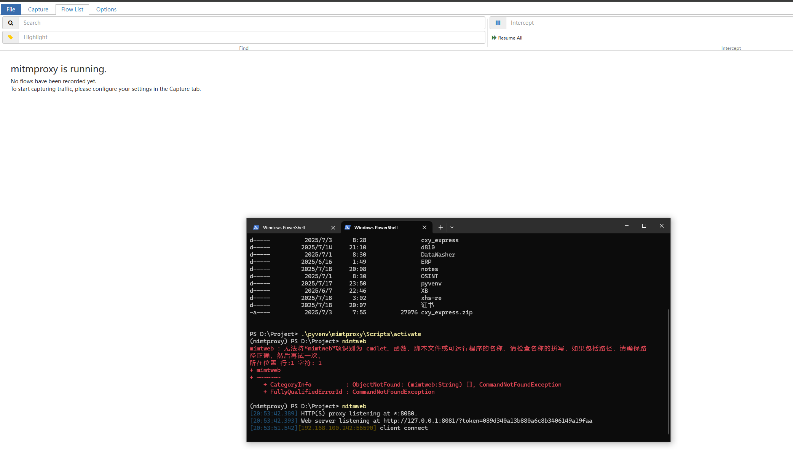

    打开某破站

    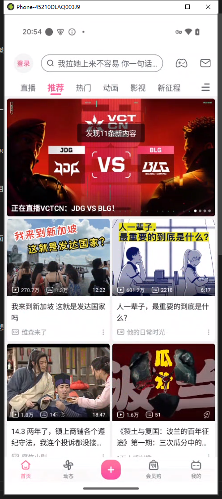


    随便在搜索看下，我们能抓到啥

    

    这不就有了吗，直接找到searchall的包，然后这是grpc zip压缩的protobuf包，丢给ai也可以解析

    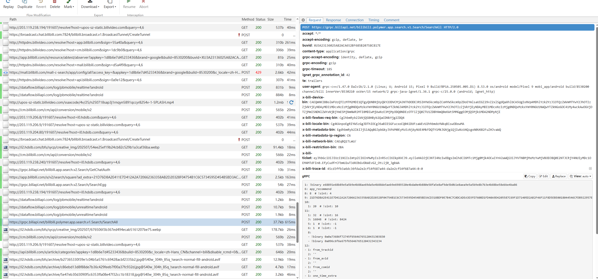


    比如我切到响应里面，随便复制一个二进制让ai帮我解析


    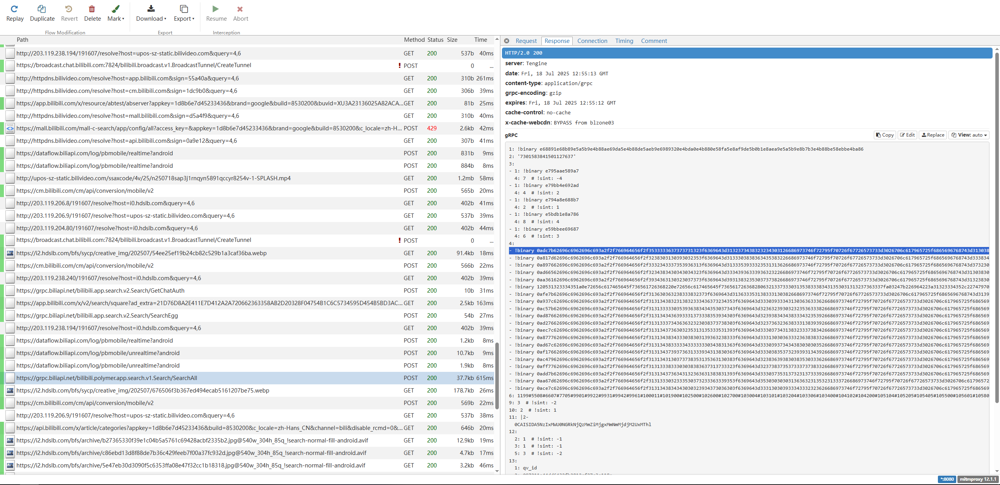


    ai解析结果


    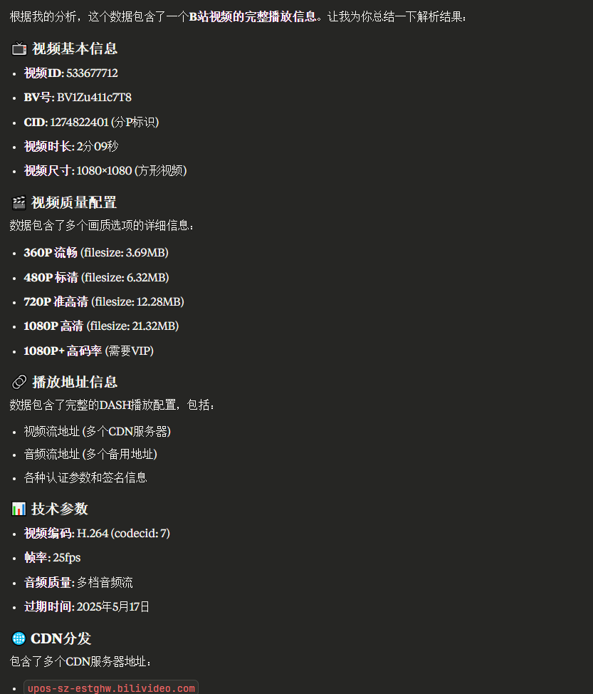

    

    我们去网页端验证一下咯


    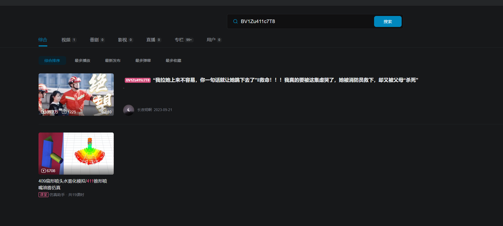
    

    
    挖草，完全一致，OK，准备工作就在这里，为啥上来就讲抓包，因为一些API的请求是通过APP的网络框架发出去的，当你通过内存的方式去向上查找他整个发包的过程怎么组包，
    
    你需要一个关键字，这些API地址就是关键字，这个后面再说，这涉及到动态调试 静态分析内容，当然还有啥过检测啥的 
    
    当然这些protobuf让ai分析也太慢了，后续肯定是逆向protobuf然后自己本地就解了，后面再说吧

    挖个天坑


神秘小脚本
```javascript

function hook_dlopen(soName = '') {
    console.log(soName)
    Java.perform(()=>{
        Interceptor.attach(Module.getGlobalExportByName("android_dlopen_ext"), {
            onEnter: function (args) {
                var pathptr = args[0];
                if (pathptr) {
                    var path = ptr(pathptr).readCString();
                    console.log("Loading: " + path);
                    if (path.indexOf(soName) >= 0) {
                        args[0] = ptr(0);
                    }
                }
            },
            onLeave: function (retVal) {
            }
        });
    })
}

hook_dlopen("libmsaoaidsec.so")

```